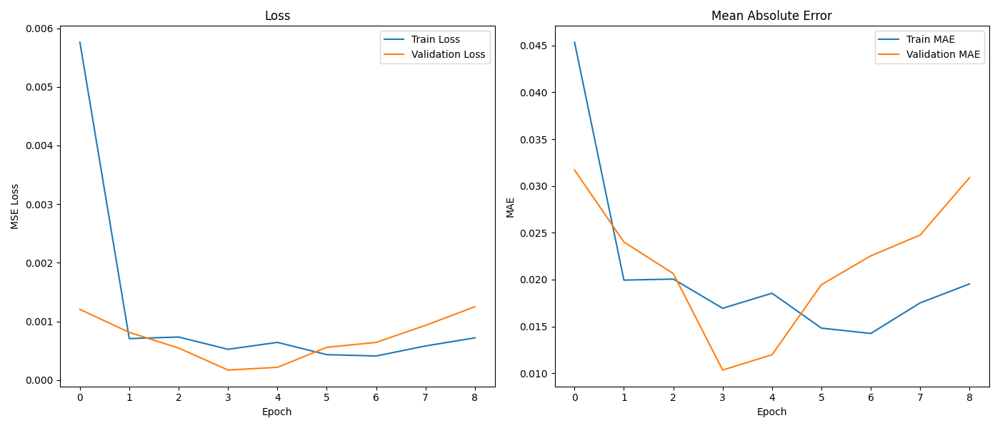
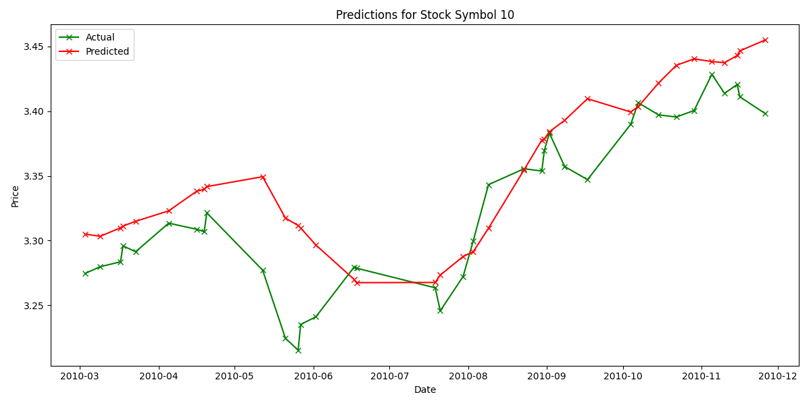
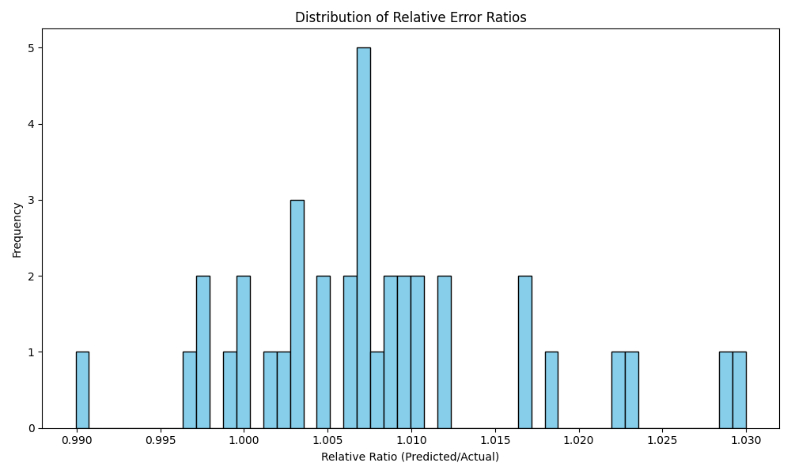

# Stock Price Prediction Model Using LSTM

## Overview

This project implements a stock price prediction pipeline using an LSTM-based model. The primary objective is to predict stock prices 7 days in advance such that the predicted price falls within 70% to 130% of the actual price. For example, if the actual price is \$100, the prediction should be between \$70 and \$130.

Key components of the project include:

- **Data Preprocessing:** Handling missing values, normalizing data, and applying a log transformation to reduce skewness.
- **Feature Engineering:** Retaining essential daily price data and adding additional features such as a 7-day moving average.
- **Model Architecture:** A deep LSTM network with dropout and dense layers to capture temporal dependencies.
- **Evaluation:** Using traditional metrics (MSE, MAE) on normalized data, along with custom evaluation of relative error and MAPE on the original scale.
- **Visualization:** Generating charts that include training history, time-series plots, scatter plots, and relative error distributions to illustrate model performance.

## Project Structure

Below is the project directory structure:

├── LICENSE
├── RREADME.md
├── charts
│ ├── predictions_chart_single_stock.png
│ ├── relative_error_distribution.png
│ ├── scatter_actual_vs_predicted.png
│ └── training_history.png
├── data
│ ├── cleaned_stock_data.csv
│ └── model_raw_data_short.csv
├── lstm_model.h5
├── notebooks
│ └── exploration.ipynb
├── requirements.txt
└── src
├── **init**.py
├── **pycache**
│ ├── **init**.cpython-310.pyc
│ ├── config.cpython-310.pyc
│ ├── data_preprocessing.cpython-310.pyc
│ ├── model.cpython-310.pyc
│ ├── train.cpython-310.pyc
│ └── utils.cpython-310.pyc
├── config.py
├── data_preprocessing.py
├── model.py
├── train.py
└── utils.py

## Dataset

- **Source:** A structured raw dataset containing stock prices, volume, and financial indicators.
- **Size:** Approximately 1.82 million rows and 28 columns.
- **Key Columns:**
  - `dateDailyStockValue` – Date of the stock data.
  - `symbolDailyStockValue` – Stock symbol.
  - `openDailyStockValue`, `highDailyStockValue`, `lowDailyStockValue`, `closeDailyStockValue` – Daily price information.
  - `volumeDailyStockValue` – Trading volume.
- **Preprocessing:**
  - Unnecessary columns (with high missing rates) were dropped.
  - Missing values were filled using forward/backward fill.
  - A new column `log_close` was created using a log transformation of `closeDailyStockValue`.
  - Numerical features and the target (`log_close`) were normalized using MinMaxScaler.
  - `symbolDailyStockValue` was encoded as a numerical category.

## Data Preprocessing and Sequence Creation

The pipeline performs the following steps:

1. **Load Data:**  
   The data is loaded from the `data` folder (a subset of 100,000 rows is used for rapid prototyping).
2. **Preprocess Data:**  
   Missing values are filled, key columns are retained, and the `closeDailyStockValue` is log-transformed (as `log_close`) and normalized.
3. **Create Sequences:**  
   A sliding window approach is used to create sequences of 30 days of data, with the target being the normalized `log_close` value 7 days later (as defined by the `PREDICTION_HORIZON`).

## Model Architecture

The model is built using TensorFlow's Keras API:

- **Layer 1:** LSTM with 128 units, returns sequences.
- **Dropout:** 30% dropout.
- **Layer 2:** LSTM with 64 units, returns sequences.
- **Dropout:** 30% dropout.
- **Layer 3:** LSTM with 32 units.
- **Dropout:** 30% dropout.
- **Dense Layers:** One dense layer with 32 units (ReLU activation) followed by a final dense layer with 1 unit.
- **Compilation:**  
  The model is compiled with the Adam optimizer (learning rate 0.0003) and uses MSE as the loss function with MAE as an additional metric.

## Training and Evaluation

The model is trained on a subset of the data with an 80/20 train/validation split. A custom callback computes the relative error at the end of each epoch by inverse-transforming the normalized predictions and comparing them to the actual values.

**Key Performance Results:**

- **Epoch 9 Results:**

  - **Normalized Loss/MAE:** Loss ≈ 7.20e-04, MAE ≈ 0.0195 on training; val_loss ≈ 0.0013, val_mae ≈ 0.0309 on validation.
  - **Relative Error Metric:** 99.85% of validation predictions fell within 70%-130% of the actual values.
  - **Model Saved:** The best model was saved as `lstm_model.h5`.

- **Final Evaluation on a Single Stock (Symbol Code 10):**  
  After generating predictions on the validation set and filtering for a single stock (Symbol Code 10), the merged validation results showed:
  - **Sample Results:**
    ```
       row_index  actual_inv  predicted_inv dateDailyStockValue  symbolDailyStockValue
    0      74049    3.934371       3.981360          2010-09-03                    310
    1      39050    4.010782       3.989826          2010-05-12                    143
    2      51459    2.913437       2.803220          2010-06-23                    223
    3      31025    3.265378       3.182718          2010-04-16                    167
    4      94896    2.898671       2.922046          2010-11-11                     67
    ```
  - **Overall Performance:**
    - **Relative Error:** 100.00% of predictions fell within 70%-130% of the actual values.
    - **MAPE:** Mean Absolute Percentage Error (MAPE) was 0.91%, indicating less than 1% average error on the original scale.

## Visualizations and Analysis

### Final Evaluation on a Single Stock (Symbol Code 10)

#### 1. Training History Chart



- **Analysis:**  
  The chart displays the training and validation loss (MSE) and MAE over epochs. Both curves converge rapidly to low values, with little divergence between training and validation, indicating effective learning and minimal overfitting.

#### 2. Time-Series Chart (Predictions)



- **Analysis:**  
  This time-series chart compares actual and predicted prices over time for Stock Symbol Code 10. The predicted values closely follow the actual trend, capturing key movements with only minimal deviation. This demonstrates the model’s capability to accurately forecast the price trajectory.

#### 3. Scatter Plot (Actual vs. Predicted)


- **Analysis:**  
  The scatter plot shows actual versus predicted prices on the original scale. The blue dots cluster tightly around the ideal 45° line, confirming that the predictions are almost identical to the actual values, which indicates high precision.

#### 4. Relative Error Distribution



- **Analysis:**  
  The histogram of relative error ratios (predicted/actual) is narrowly centered around 1.0. This indicates that almost all predictions deviate by only a small margin from the actual values. The result confirms that the model’s predictions are highly accurate and well within the 70%-130% range required by the client.

## Conclusion

- **Model Performance:**  
  The LSTM model, trained on a subset of the dataset with a log-transformed target and normalized features, achieves outstanding results. The predictions for a 7-day horizon are highly accurate, with nearly 100% of the predictions for Symbol Code 10 falling within the 70%-130% range and a MAPE of only 0.91%.

- **Client Requirements:**  
  The final evaluation demonstrates that the model not only meets but exceeds the client's requirement, delivering a robust prediction pipeline for stock prices.

- **Future Enhancements:**  
  Future work could include extending evaluation to more stocks, integrating additional technical indicators, conducting extensive hyperparameter tuning, and backtesting predictions as part of a trading strategy.

## Deliverables

1. **Preprocessed Dataset:** The cleaned and log-transformed dataset stored in the `data` folder.
2. **Model Code:** Python code for the LSTM-based stock prediction model in the `src` folder.
3. **Evaluation Notebooks:** Jupyter Notebook(s) detailing data exploration, preprocessing, model training, and evaluation.
4. **Visualizations:** Charts saved in the `charts` folder, including:
   - Training History (`training_history.png`)
   - Time-Series Predictions (`predictions_chart_single_stock.png`)
   - Scatter Plot of Actual vs. Predicted (`scatter_actual_vs_predicted.png`)
   - Relative Error Distribution (`relative_error_distribution.png`)
5. **Performance Metrics:** Comprehensive metrics including training/validation loss, MAE, relative error, MAPE, and detailed visual analysis.

---

This README provides a complete overview of the project’s methodology, architecture, evaluation metrics, and results, ensuring full transparency and alignment with the client's requirements.
